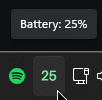
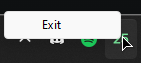

# Razer systray battery

## Introduction

This is a HEAVILY modified version of the [script by Tung Yu Hsu](https://github.com/hsutungyu/razer-mouse-battery-windows)  
If you want to use the original script, please go to the link above.

## Changes made

- Remove notification thing
- Add system tray icon instead
- Add battery percentage to the icon which updates every 5 minutes
- Battery percentage on icon is dynamic created using Pillow
- Icon color changes to red when battery is below 5%
- Icon color changes to blue when battery is above 95%
- Icon color stays green when battery is between 5% and 95%
- Right click menu has exit button to kill the script
- Uses py2exe to create a standalone executable, which can be thrown into the startup folder
- Removed the requirement of using Task Schedular. Not my cup of tea.

## To compile

- Install the requirements using `pip install -r requirements.txt`
- Run `python3 setup.py`
- The executable will be in the `dist` folder.
- Throw the executable into the startup folder to run on startup

## Images

