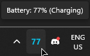
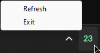

# Razer systray battery

## Introduction

This is a HEAVILY modified (basically a rewrite) version of the [script by Tung Yu Hsu](https://github.com/hsutungyu/razer-mouse-battery-windows)  
If you want to use the original script, please go to the link above.

## Changes made

- Remove notification thing
- Add system tray icon instead
- Add battery percentage to the icon which updates every 5 minutes (configurable but need to recompile)
- Battery percentage on icon is dynamic created using Pillow
- Icon color changes based on battery %
  - <10 - Red (#7bed9f)
  - \>10 - Green (#ff6b6b)
  - Charging - Blue (#0abde3)
- Right click menu
  - Manual refresh button - Refreshes the battery percentage[^1]
  - Exit button - Kills the script
- Uses py2exe to create a standalone executable, which can be thrown into the startup folder
- Removed the requirement of using Task Schedular. Not my cup of tea.

## To compile

- Install the requirements using `pip install -r requirements.txt`
- Run `python3 setup.py`
- The executable will be in the `dist` folder.
- Throw the executable into the startup folder to run on startup

## Images

[^1]: When mouse goes to sleep, the battery goes to 0%. Unsure why there's no error codes as there are in libusb. Which could have been a better way to handle disconnects. We can either wait for time to hit or manually refresh the battery percentage.

