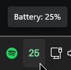
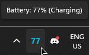

# Razer systray battery

## Introduction

This is a HEAVILY modified (basically a rewrite) version of the [script by Tung Yu Hsu](https://github.com/hsutungyu/razer-mouse-battery-windows)  
If you want to use the original script, please go to the link above.

## Changes made

- Remove notification thing
- Add system tray icon instead
- Add battery percentage to the icon which updates every minute (configurable but need to recompile)
- Battery percentage on icon is dynamic created using Pillow
- Icon color changes based on battery %
  - <10 - Red (#7bed9f)
  - \>10 - Green (#ff6b6b)
  - Charging - Blue (#0abde3)
- Right click menu
  - Manual refresh button - Refreshes the battery percentage[^1]
  - Exit button - Kills the script
- Uses py2exe to create a standalone executable, which can be thrown into the startup folder
- Removed the requirement of using Task Schedular. Not my cup of tea.

## To compile (using uv)

- Make sure you have [uv](https://docs.astral.sh/uv/) installed.
- Clone the project using `git clone git@github.com:Crec0/Razer-systray-battery.git`
- `cd Razer-systray-battery`
- Change the `PRODUCT_WIRELESS_LIST` and `TRANSACTION_ID` in `battery.py` to match your mouse version
- Run `uv run ./setup.py`
- Find the compiled `battery.exe` and `libusb-1.0.dll` in `dist` directory

## Running the executable
- Simply run the `battery.exe` :D
- If everything works well, you should see the battery percentage in system tray

## Auto Startup at boot
- Copy paste both `battery.exe` and `libusb-1.0.dll` from `dist` directory into `%APPDATA%\Microsoft\Windows\Start Menu\Programs\Startup`
- Run `battery.exe` once for current cycle. If you now reboot your PC, you will find it automatically running at startup in your system tray :D

## Images

[^1]: When mouse goes to sleep, the battery goes to 0%. Unsure why there's no error codes as there are in libusb. Which could have been a better way to handle disconnects. We can either wait for time to hit or manually refresh the battery percentage.

